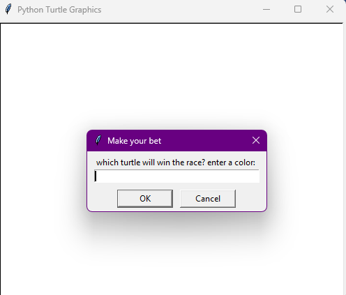
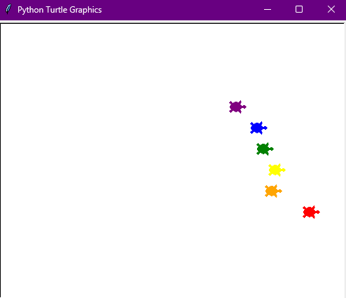

# Turtle Race
## Overview
Hello, everyone! I'm Mert, and today marks Day 19 of my "100 Days of Python" challenge. For today's project, I'm excited to introduce "Turtle Race," a fun and interactive Python program using the Turtle graphics library. This project simulates a colorful race between turtles, with users placing bets on the winner.

## Project Description
"Turtle Race" features a race track with turtles of different colors. Users are prompted to bet on a turtle by entering its color. The race unfolds with turtles moving forward randomly, and the winner is determined when one turtle crosses the finish line. The program then notifies the user if their bet was successful.





## How to Run
To experience the excitement of the Turtle Race, run the following command:

```bash
python turtle_race.py
```

Ensure that you have Python installed on your system.

## Project Files
- `turtle_race.py`: The main Python script for the Turtle Race project.

## Getting Started
1. The program will prompt you to enter your bet by choosing a turtle color.
2. Watch as the turtles race forward with random distances.
3. Discover the winner and find out if your bet was successful!

## Educational Insights
This project offers a hands-on experience with the following Python concepts:

- Turtle Graphics: Utilizing the Turtle graphics library to create an interactive and visual program.
- User Input: Collecting user bets through text input.
- Randomization: Introducing randomness to simulate the unpredictable nature of the race.
- Conditional Statements: Checking winning conditions and providing feedback to the user.

## Customization
Feel free to explore and customize the project by adjusting colors, race distances, or even adding more turtles to the race. It's an excellent opportunity to experiment and enhance your Python programming skills.

## Conclusion
I hope you enjoy the Turtle Race project! It's been a fantastic journey reaching Day 19, and I'm eager to continue exploring and learning. Have fun racing turtles, and happy coding!
